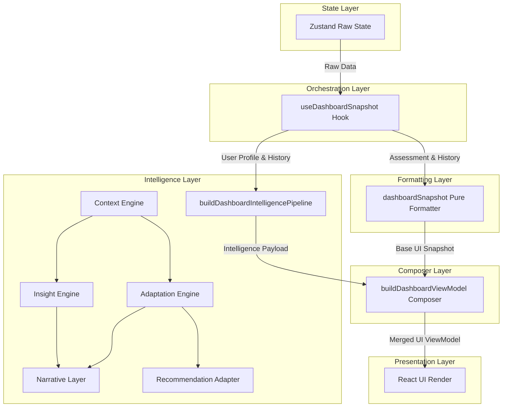

# Carbon Health Platform

## Project Overview

The Carbon Health Platform is a deterministic behavioral intelligence system designed to track, analyze, and drive actionable climate impact. Unlike traditional carbon trackers that simply aggregate emissions data, this platform operates as an explainability-driven behavior modification engine. It translates raw carbon footprint assessments and daily engagement metrics into personalized, actionable, and dynamically adapting insights, driving sustained user engagement without relying on non-deterministic AI/ML black boxes.

## Problem Statement

Existing carbon tracking solutions suffer from critical flaws:
1. **Engagement Fatigue:** Static goals and rigid recommendations lead to rapid user drop-off.
2. **Analysis Paralysis:** Overwhelming users with raw data without context or prioritization.
3. **Non-Deterministic "AI" Recommendations:** Generative systems produce inconsistent, unexplainable, and often impossible suggestions, eroding user trust.
4. **God Object Architecture:** Monolithic frontends tightly couple state, computation, and rendering, making scaling and testing extremely difficult.

The Carbon Health Platform solves these by introducing a strictly layered, deterministic, pure-function execution graph that provides intelligent, habit-aligned recommendations with complete architectural safety.

## System Architecture

The architecture enforces a **Closed Execution Graph** with a unidirectional data flow. By separating state management, computation, formatting, and UI rendering into isolated layers, the system guarantees architectural integrity, testability, and determinism.

### Architecture Flow Diagram

## Layered Design Explanation

### 1. State Layer (Zustand & Queries)
Manages raw, normalized data (User Profile, Check-ins, Missions, Assessments). No derived data or business logic exists here. Zustand queries simply extract raw state arrays/objects.

### 2. Orchestration Layer (Hooks)
The Snapshot Hooks (e.g., `useDashboardSnapshot`) act as ultra-thin orchestrators. They contain **zero** business logic. Their sole responsibility is to extract state via queries and route it sequentially through the purely functional pipelines below.

### 3. Intelligence Pipeline Layer
This layer houses the "brain" of the application. It consists of pure, deterministic functions (`buildDashboardIntelligencePipeline`) that process user engagement metrics and calculate psychological context without mutating global state.

- **Context Engine:** Distills daily check-ins into engagement levels and motivation vectors.
- **Adaptation Engine:** Generates priority modifiers and difficulty multipliers based on user context.
- **Fatigue Engine:** Implements a deterministic exhaustion model. It tracks active/completed/archived missions and pseudo-randomly shuffles recommendations using a static weekly seed to combat visual fatigue.
- **Insight Engine:** Derives distinct, actionable observations from the context.
- **Narrative Layer:** Maps the adaptation and insights into human-readable, behavior-driven UI copy.
- **Recommendation Adapter:** Sorts, filters, and scales the raw catalog recommendations based on the calculated adaptation modifiers and fatigue exclusions.

### 4. Snapshot Layer
The pure formatters (`dashboardSnapshot.ts`). This layer calculates footprint scores, determines streaks, and formats base data for the UI. It is entirely unaware of the intelligence pipeline, ensuring the core functionality of the platform remains safe and testable.

### 5. Composer Layer
The pure merger (`buildDashboardViewModel.ts`). It takes the distinct outputs from the Intelligence Pipeline and the Base Snapshot, resolving them into a single, unified view model. It ensures the hook orchestrator doesn't have to concern itself with object destructuring or conflict resolution.

### 6. Presentation Layer (UI)
React components are strictly "dumb" renderers. They consume the view model provided by the Composer Layer and paint it to the screen. No data transformations occur here.

## Key Features

- **Explainable Adaptation:** Every recommendation shift, priority bump, and narrative change can be traced back to a specific, deterministic rule in the pipeline.
- **Zero-State Fatigue Mitigation:** Visual fatigue is combatted by rotating recommendations organically at the start of a new week using seeded pseudo-randomization, requiring no additional persistence or database bloat.
- **Strict Boundary Enforcement:** TypeScript is leveraged to ensure that raw state never accidentally leaks into the UI layer without passing through a snapshot formatter.
- **O(1) Extensibility:** New intelligence engines or behavioral modifiers can be added to the pipeline without touching the React components or the Zustand state store.

## Design Principles

1. **Determinism Above All:** Identical state inputs will always produce identical UI outputs. No non-deterministic models (like LLMs) sit in the critical execution path.
2. **Single Read/Write Paths:** State is strictly mutated via Actions and read via Pipeline orchestration. There are no side-channels or component-level state derivations.
3. **Actionability > Calculation:** The platform prioritizes telling the user *what to do next* over simply showing them a complex graph of their emissions.
4. **Architectural Purity:** Hooks do not compute. Snapshots do not orchestrate. Components do not adapt.

## Future Scope

Because the architecture operates as a strictly decoupled execution graph, the system is highly extensible for the future:
- **Server-Side Rendering (SSR) Ready:** The pure pipelines and snapshots can run perfectly on edge servers or Next.js API routes before React is even hydrated.
- **A/B Testing Integration:** Different `buildDashboardIntelligencePipeline` variants can be easily swapped in at the Hook orchestration level without touching a single React file.
- **Advanced Behavioral Analytics:** The structural logging of Context and Adaptation results can be directly piped into a data warehouse to monitor the effectiveness of different behavioral modifiers.

## Why This Project is Architecturally Strong

This platform demonstrates senior-level system design by recognizing that **frontend complexity is almost exclusively an orchestration and state-coupling problem**. 

By applying backend-style pipeline architectures and strict domain-driven design principles to the React ecosystem, the "Carbon Health Platform" mitigates the infamous "God Object" hook anti-pattern. It proves that personalized, intelligent, dynamic user experiences can be achieved reliably, safely, and predictably through rigorous structural discipline.
